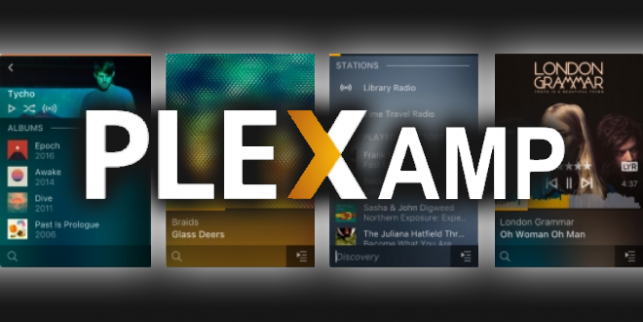

# plexamp-headless



This Ansible playbook will install [Plexamp](https://www.plex.tv/plexamp/), the standalone music player for [Plex](https://www.plex.tv/), specifically the [headless](https://www.plex.tv/plexamp/#downloads) variety, so it can be controlled via a Plexamp running on your phone, computer or tablet. While the download page advertises the headless variant runs on a [Raspberry Pi](https://www.raspberrypi.com/), this project aims to automate the installation on a Raspberry Pi, or any generic Linux hosts. Having an enpoint to stream from Plex that can directly connect to a stereo component is the goal. Longer term I would like to see how close this could come to being a [Roon](https://roon.app/) replacement, which is not open source. Note, Plex is not open source, but free to use, and after years of being a paid for only option, Plexamp is now free as well. So while none of this is free as Open Source, it's the best music streaming option I've found to do what (I think) I want it to do.

## Requirements

* A Linux host to install Plexamp Headless on - this code has been developed on [Debian](https://www.debian.org/), which is the basis for the official [Raspberry Pi OS](https://www.raspberrypi.com/software/), in fact they used to call it [Rasbian](https://www.raspbian.org/)
* A running Plex server 

## Setup

* Install [Ansible](https://www.ansible.com/) - in Debian (Raspberry Pi OS, Ubuntu, Mint, etc...) and [git](https://git-scm.com/)

```
(sudo) apt install ansible git
```

* Checkout this Ansible code

```
git clone https://github.com/philcryer/plexamp-headless.git
```

## Install 

## Post-config

* Next we need the the claim code from your running Plex server. To do this, hit [https://www.plex.tv/claim/](https://www.plex.tv/claim/) and copy the code it displays


## Acknowledgements

## License

Thanks
