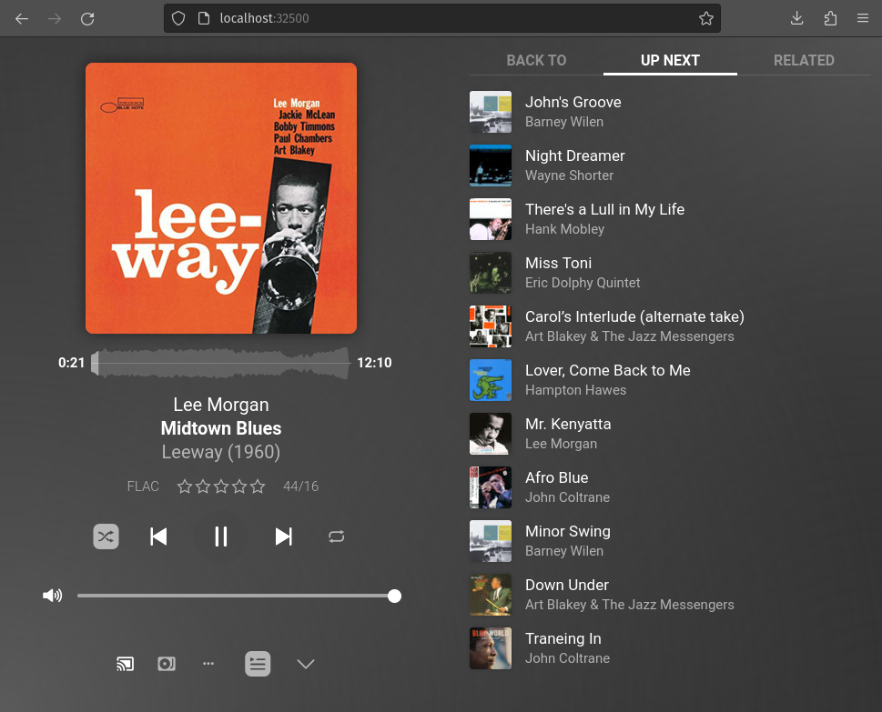
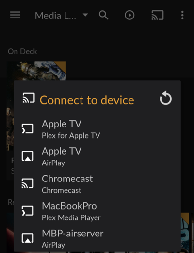

# plexamp-headless


This Ansible playbook will install [Plexamp](https://www.plex.tv/plexamp/), the standalone music player for [Plex](https://www.plex.tv/), specifically the [headless](https://www.plex.tv/plexamp/#downloads) variety, so it can be controlled via a Plexamp running on your phone, computer or tablet. While the download page advertises the headless variant runs on a [Raspberry Pi](https://www.raspberrypi.com/), this project aims to automate the installation on a Raspberry Pi, or any generic Linux hosts. Having an enpoint to stream from Plex that can directly connect to a stereo component is the goal. Longer term I would like to see how close this could come to being a [Roon](https://roon.app/) replacement, which is not open source. Note, Plex is not open source, but free to use, and after years of being a paid for only option, Plexamp is now free as well. So while none of this is free as Open Source, it's the best music streaming option I've found to do what (I think) I want it to do.

NOTE: This Ansible code has been developed on [Debian](https://www.debian.org/), which is the basis for the official [Raspberry Pi OS](https://www.raspberrypi.com/software/), in fact they used to call it [Rasbian](https://www.raspbian.org/). Once this complete and working I would like to get it running under [Fedora](https://fedoraproject.org/) so we can see it running on [Silverblue](https://fedoraproject.org/silverblue/), which is what I'm moving my Plex server to next.

## Requirements

* A Linux host (Debian, Rasbian, Raspberry Pi OS supported, for now)
* A user with sudo access on the host
* A running Plex Media Server 

## Setup

* Install [Ansible](https://www.ansible.com/) and git - in Debian (Raspberry Pi OS, Ubuntu, Mint, etc...)

```
(sudo) apt install ansible git
```

* Checkout this Ansible code

```
git clone https://github.com/philcryer/plexamp-headless.git
```

## Install

* Change into the plexamp-headless directory

```
cd plexamp-headless
```

* Run ansible-playbook, with the `-K` option, which will prompt you for your root or sudo password, note that this runs again localhost, if you want to target a remote server, edit the `hosts` file and enter the IP of your remote host.

```
ansible-playbook play.yml -K
```

## Post-config

* Next we need the the claim code from the running Plex server so that Plexamp Headless can talk to it. To do this, hit [https://www.plex.tv/claim/](https://www.plex.tv/claim/) in a browser, it will look like this (your number will be different)


Now back on the commandline we need to become the `plexamp` user on the host we installed to, first use `sudo` to become root, then `su` to become the plexamp user. As the plexamp user we'll run Plexamp Headless for the first time

```
x sudo su -
root@hostname:~# su - plexamp
plexamp@hostname:~$ node plexamp/js/index.js 
This browser doesn't support requestAnimationFrame. Make sure that you load a polyfill in older browsers. https://reactjs.org/link/react-polyfills
This browser doesn't support cancelAnimationFrame. Make sure that you load a polyfill in older browsers. https://reactjs.org/link/react-polyfills
Starting Plexamp 4.9.5
Please visit https://plex.tv/claim and enter the claim token: 
```

* Now paste in the code you got from [https://www.plex.tv/claim/](https://www.plex.tv/claim/), hit enter and follow the prompts to name your Plexamp Headless server (this is the name that you'll see in your Plexamp clients). After this step it will setup Plexamp Headless, and then it will be ready to run.

## Running

Since we setup this as a systemd service, and it will come up on every boot, you can either reboot, or become root so you can run start it as a systemd service. If you're still logged in as user `plexamp` exit that, and run the systectl command to start the plexamp-headless service

```
exit
root@hostname:~# systemctl start plexamp-headless.service
```

* Now in a broswer you should be able to hit it directly, if it's running on the same host you could hit it at [http://localhost:32500/](http://localhost:32500/), otherwise target the IP that Plexamp Headless is running on, and add that port. For example, if you have a 192.168.1.0 subnet the IP could be: [http://192.168.1.50:32500](http://192.168.1.50], you can look that up on your router, then you'll be prompted to login with your Plex account, login with that then you'll get to the plexamp's UI and you'll see all the music you can see in your normal Plex Media Server.



* On a deskop, phone, or tablet running Plexamp, you should be able to see it under 'Players', click on the 'Cast' looking icon on the top right, and it'll give you a list of poential players. Click on the one you're running and you should now have remote control over that instance



## Troubleshooting

* Sometimes on the first run the player will refuse to play any music, if this happens go to Settings (the cog icon on the bottom right) -> Audio Output -> Audio Device and look over your options. On my test system I had a USB speaker that wasn't the default so I just had to choose `USB2.0 Device: USB Audio` to get the game going, so just choose one you think is right, click the Home button, try to play something; rinse and repeat until you find success.

## Acknowledgements

Standing on the shoudlers of giants.

* [zonywhoop/ansible-role-plexamp-headless](https://github.com/zonywhoop/ansible-role-plexamp-headless/tree/main) - the bootstrap for this project, it has the basis for much of what I've done, but I've rewritten/moderized it and added some features that I want to expand on that aims to bring this up hosts other than a Raspberry Pi, and ultimately, on non-Debian based systems, while looking for tweaks to improve audio quality as we go
* [Install Headless Plexamp for your Raspberry Pi to create a Plex endpoint](https://howtohifi.com/install-headless-plexamp-endpoint-home-network-raspberry-pi/) - a great, detailed post that showed all the steps and some gotchas with workarounds. This is the kind of HOWTO I try to write when I'm sharing things on my blog. Excellent work.
* [Oefenwe/ansible-nodejs](https://github.com/Oefenweb/ansible-nodejs/tree/master) - updated instructions on using the new methods from [Nodesource](https://deb.nodesource.com/) to install nodejs, the old Ansible module `apt_key` has been deprecated, so there are newer, better ways to install nodejs and this project got me there
* [Plexamp](https://www.plex.tv/plexamp/) - I really like Plex, so much so that I bought a lifetime 'Plex Pass', and I use it daily on my Debian Linux server for movies and shows. Music too, of course, but the lack of gapless playback has ALWAYS been a thorn in my side. I really love so many of the decisions they've made with Plexamp, and I hope my project helps others adopt and run a truly great headless audio endpoint. I'm very interested in learning more about kernel parameters and other tweaks to make Linux audio as good as it can be. 

## License

[MIT License](LICENSE)

Thanks
